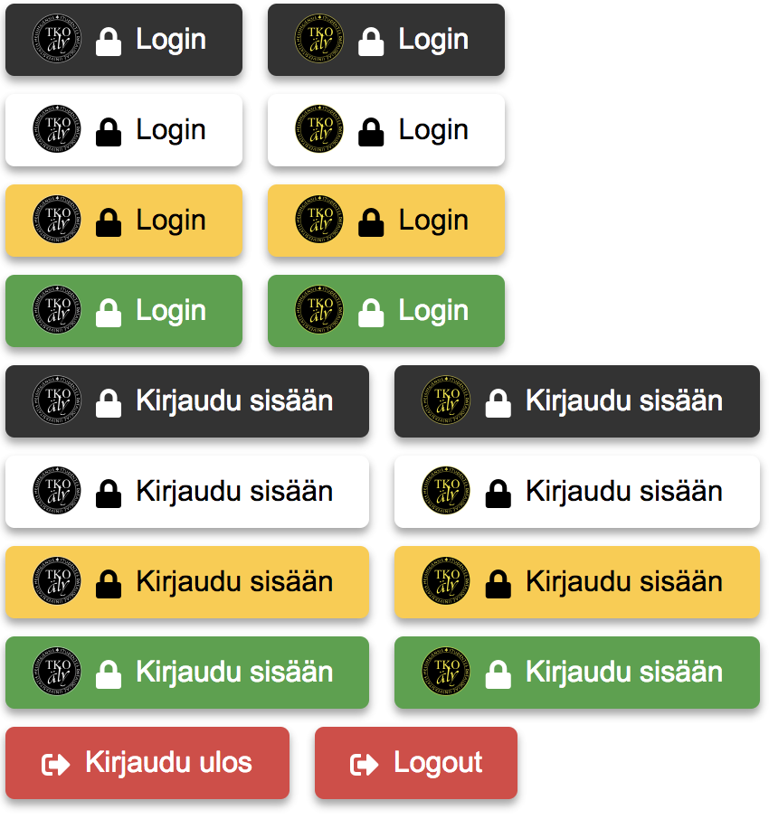

# tekis-auth-buttons

## Introduction

This repository contains source code for login & logout buttons used in TKO-äly's user service.

## Instructions

1. Clone the repo
2. Run `yarn install`
3. Run `yarn build` and copy `src/css/authButton.css` to your server. Include in in the `<head>` tag. Also, copy the `img` folder. In the future the CSS and logos will be served through TKO-äly's CDN.

## Development

1. Clone the repo
2. Run `yarn install`
3. Run `yarn start` and go to `localhost:5000`
4. Run `yarn clean` to clean the compiled CSS.

## Demo

## License

This project has been licensed with MIT license.